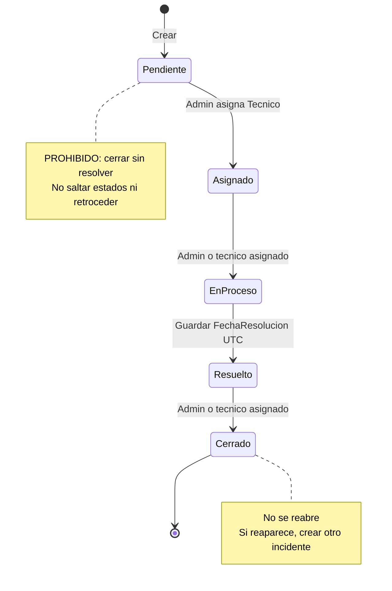
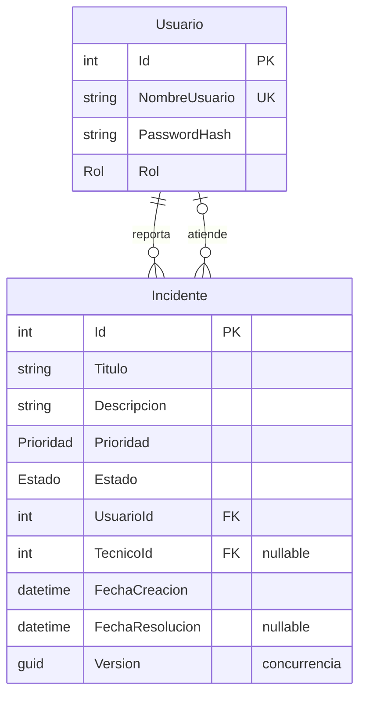
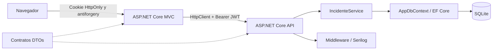

# Diagramas editables (Mermaid)
## Estados

```mermaid
stateDiagram-v2
    [*] --> Pendiente: Crear
    Pendiente --> Asignado: Admin asigna Tecnico
    Asignado --> EnProceso: Admin o tecnico asignado
    EnProceso --> Resuelto: Guardar FechaResolucion UTC
    Resuelto --> Cerrado: Admin o tecnico asignado
    Cerrado --> [*]
    note right of Pendiente
      PROHIBIDO: cerrar sin resolver
      No saltar estados ni retroceder
    end note
    note right of Cerrado
      No se reabre
      Si reaparece, crear otro incidente
    end note
```
## Entidad-relación

```mermaid
erDiagram
    Usuario ||--o{ Incidente : reporta
    Usuario o|--o{ Incidente : atiende
    Usuario {
        int Id PK
        string NombreUsuario UK
        string PasswordHash
        Rol Rol
    }
    Incidente {
        int Id PK
        string Titulo
        string Descripcion
        Prioridad Prioridad
        Estado Estado
        int UsuarioId FK
        int TecnicoId FK "nullable"
        datetime FechaCreacion
        datetime FechaResolucion "nullable"
        guid Version "concurrencia"
    }
```
## Arquitectura

```mermaid
flowchart LR
    Browser[Navegador] -->|Cookie HttpOnly y antiforgery| MVC[ASP.NET Core MVC]
    MVC -->|HttpClient + Bearer JWT| API[ASP.NET Core API]
    API --> Service[IncidenteService]
    Service --> EF[AppDbContext / EF Core]
    EF --> DB[(SQLite)]
    API --> Logs[Middleware / Serilog]
    Contracts[Contratos DTOs] -.-> MVC
    Contracts -.-> API
```
